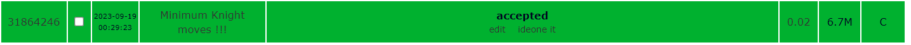
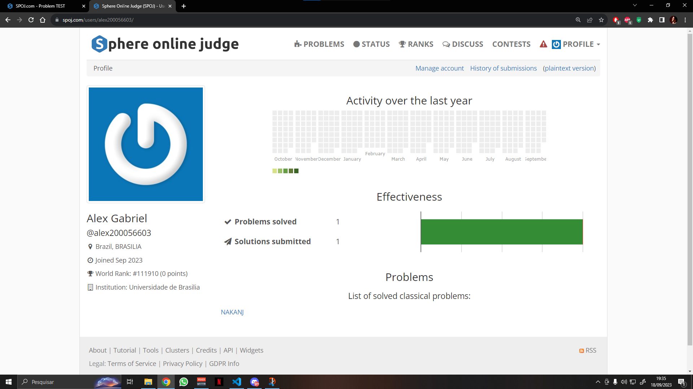

# NAKANJ - Minimum Knight moves

Anjali and Nakul are good friends. They both had a quarrel recently while playing chess. Nakul wants to know the minimum number of moves a knight takes to reach from one square to another square of a chess board (8 × 8). Nakul is brilliant and he had already written a program to solve the problem. Nakul wants to know whether Anjali can do it. Anjali is very weak in programming. Help her to solve the problem.

A knight can move in the shape of an "L" in a chessboard - two squares either forward, backward, left, or right and then one square to its left or right. A knight move is valid if it moves as mentioned above and it is within the boundary of the chessboard (8 × 8).

## Input
There are T test cases in total. The next T lines contain two strings (start and destination) separated by a space.

The strings start and destination will only contain two characters - First character is an alphabet between 'a' and 'h' (inclusive), Second character is a digit between '1' and '8' (inclusive) - (Quotes just for clarity).

To know the knight moves more clearly refer to the above figure.

## Output

Print the minimum number of moves a knight takes to reach from start to destination in a separate line.

Constraints
1 <= T <= 4096

### Example  
#### Input:  
3  
a1 h8  
a1 c2  
h8 c3  
#### Output:  
6  
1  
4  
## Resultado

Enviado ao juiz online!

Aceito!

Perfil de envio

## Explicação do codigo

[Video explicando](https://youtu.be/1y4jNi71_tM)
O vídeo também pode ser encontrado na pasta "Assets" do repositório!