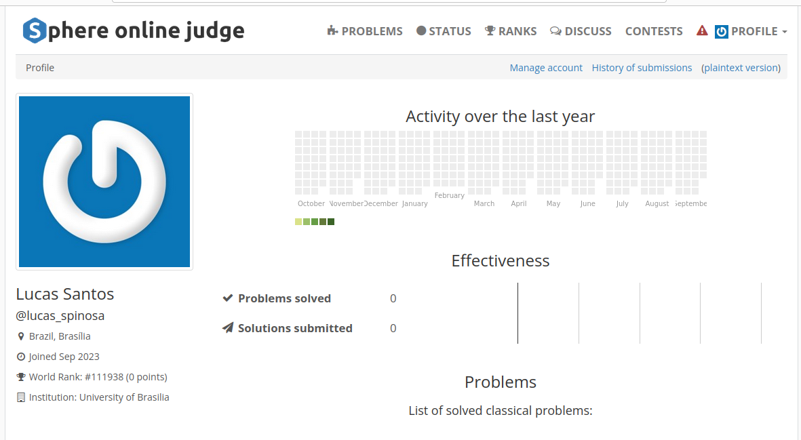

# NATUREZA - Natureza

Na natureza, existem as cadeias alimentares. Na base dessas cadeias, geralmente temos os vegetais. Pequenos animais comem esses vegetais e animais maiores comem os menores. Podem ocorrer ciclos em uma cadeia, como quando um animal morre e inicia-se um processo de decomposição que transformará seu corpo em minerais que são uma fonte de energia para os vegetais.

Neste problema você deverá encontrar a maior cadeia alimentar para um dado grupo de criaturas. Você pode considerar que se A é o predador de B então eles estão na mesma cadeia. 

## Entrada
O arquivo de entrada contém vários conjuntos de teste. A descrição de cada conjunto é dada a seguir:

Cada conjunto começa com dois inteiros C (1 ≤ C ≤ 5000), o número de criaturas, e R (0 ≤ R ≤ 5000), o número de relações. Seguem C linhas com os nomes das criaturas, cada nome é formado somente por letras minúsculas (a, b, ..., z). Nenhum nome possui mais do que 30 caracteres. Por fim, haverá R linhas descrevendo as relações. Cada linha terá o nome de 2 criaturas, indicando qua a segunda criatura é um predador da primeira.
Você pode assumir que nenhuma criatura é predadora dela mesma.

A entrada é terminada por um conjunto onde C = R = 0. Este conjunto não deve ser processado. Há uma linha em branco entre dois conjuntos de entrada. 

## Saída

Para cada conjunto de entrada produza uma linha de saída, o tamanho da maior cadeia alimentar. 

### Exemplo  
#### Entrada:  

5 2 
caterpillar 
bird 
horse 
elefant 
herb 
herb caterpillar 
caterpillar bird 

0 0 
#### Saída:  
3
## Resultado

O código foi enviado ao juíz online, tendo como resultado Accepted.

Aceito!

Perfil de envio

## Referência

O exercício se encontra no link abaixo:
- [Sphere online judge](https://br.spoj.com/problems/NATUREZA/)